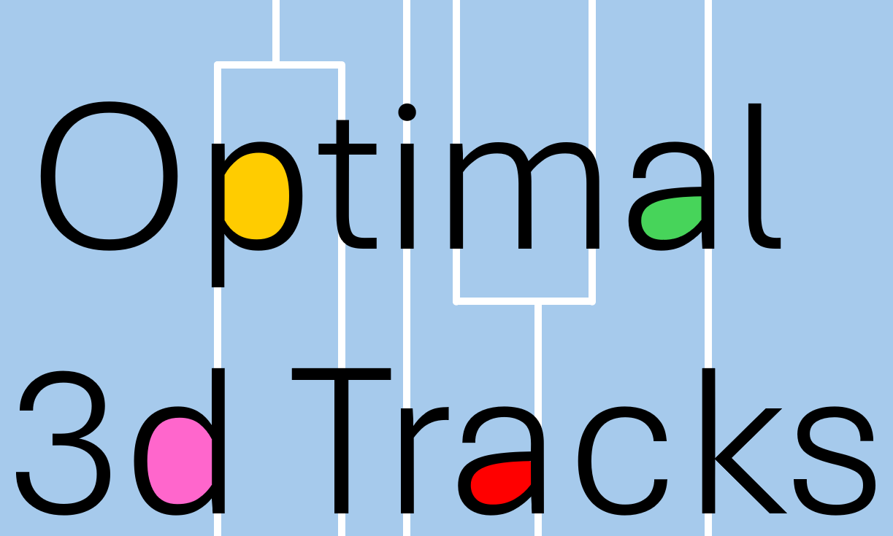

*Copyright (c) 2023-2024 Anita Karsa, University of Cambridge, UK*

*Optimal3dTracks is distributed under the terms of the GNU General Public License*

ABOUT
-------------------------------------------------------------------------------
Optimal3dTracks is a cell tracking tool that turns 3D, segmented cells/nuclei
into cell tracks or lineage trees by identifying cell migration, division and, 
optionally, merging events. It requires the original intensity images and 
the label maps as inputs. Cell tracking is performed by 1. fitting 3D Gaussians 
to each segmented cell or nucleus, 2. calculating transition probability matrices 
using Gaussian Mixture Model Optimal Transport (https://github.com/judelo/gmmot) 
with Kullback-Leibler regularisation, and then 3. turning these matrices into the 
highest-probability valid transition matrices. Affine registration between time 
points is also included for improved accuracy. Step 3 and the use of sinkhorn for 
step 2 are the main innovations of this pipeline. Our transition model allows for 
cells to divide into max. 2 cells between time points and max. 2 cells to merge 
into one between two time points. It does not account for cells going in and out 
of the field of view. The tool also includes the option to save calculated tracks 
as an .xml file for manual track correction/curation using Fiji's TrackMate tool, 
as well as customisable visualisation of the dendogram.    

  

HOW TO USE
-------------------------------------------------------------------------------
First, install required packages (see dependencies).

**To perform cell tracking with Optimal3dTracks** (see src/example.ipynb):

```
# 1. Calculate 3D Gaussian parameters for each segmented region at each time point
calculate_Gaussian_parameters(label_files, intensity_files, save_folder, resolution)

# 2. Create track segments between consecutive time points
calculate_track_sections(label_files, intensity_files, Gaussian_parameter_files, save_folder_for_affine,
                              save_folder_for_tracks, resolution, max_number_of_cells_per_timepoint)

# 3. Concatenate track segments
track_df, split_df, merge_df = concatenate_track_sections(track_files,Gaussian_parameter_files,
                                                          save_folder,max_number_of_cells_per_timepoint)
```

**To save tracks as .xml for correction/curation in Fiji** (see src/example.ipynb):
```
save_as_TrackMate(track_df,split_df,merge_df,label_files,dimensions,resolution,base_file,save_file)
```
*Note: You can specify whether you'd like to correct tracks in 3D (dimensions = 3) or on the 2D MIPs (dimensions = 2)*

**To plot the dendogram** (see src/example.ipynb):
```
generate_tree(track_df, split_df, merge_df)
```

HOW TO ACKNOWLEDGE
-------------------------------------------------------------------------------
@software{optimal3dtrack,

  author       = {Anita Karsa},

  title        = {{Optimal3dTracks}},

  month        = feb,

  year         = 2024,

  url 	       = {https://github.com/akarsa/Optimal3dTracks}

}

@article{karsa2024optimal3dtracks,

  title={A novel pipeline for robust and accurate, automated 3D nucleus segmentation and tracking in light-sheet microscopy images (manuscript under preparation)},

  author={Karsa, Anita and Boulanger, Jerome and Abdelbaki, Ahmed and Niakan, Kathy K. and Muresan, Leila},

}

DEPENDENCIES
-------------------------------------------------------------------------------
numpy (https://numpy.org)

scipy (https://scipy.org)

matplotlib (https://matplotlib.org)

scikit-image (https://scikit-image.org)

pandas (https://pandas.pydata.org)

ot (https://pythonot.github.io/)

gmmot (https://github.com/judelo/gmmot)

SimpleITK (https://github.com/SimpleITK/SimpleITK)

csbdeep (https://github.com/CSBDeep/CSBDeep)

tifffile (https://github.com/cgohlke/tifffile)

pathlib (https://github.com/budlight/pathlib)


CONTACT INFORMATION
-------------------------------------------------------------------------------
Anita Karsa, Ph.D.

Cambridge Advanced Imaging Centre

Dept. of Physiology, Development, and Neuroscience

University of Cambridge,

Cambridge, UK

ak2557@cam.ac.uk
